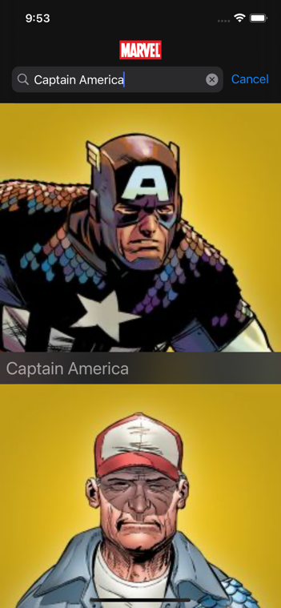
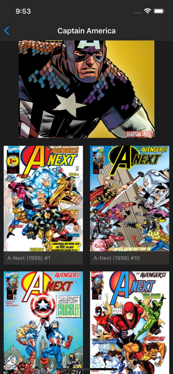
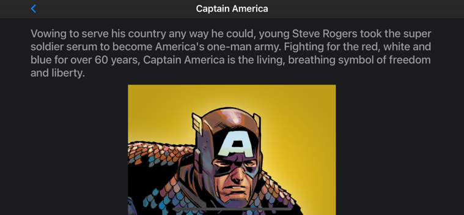

# Marvel Client

## Product Description

I decided to use the Characters as the entry point for the app because I feel that the first thing you want to do with the Marvel catalog is to find your favorite Character. Then you can browse the Comics in which that Character is included.

So the app contains a first screen that is a list of Characters, then when you select some of them, you will see more detailed information of that Character and all Comics in which they have appeared.

I exclude some functionality like Creators, Event, Series and Stories. Those could be added in future iterations. I excluded those for now because of time constraints mainly. Also, another important feature that can be added in the future is the Comic details screen.

I added some needed features that weren't define but those are really needed, like:

+ Pagination in both screens.
+ Search bar to find your Character.
+ Rotation.
+ Dark mode.
+ Pull down to refresh in both screen.

## iPad and macOS support

Thanks to Catalyst this app runs in macOS as you can see in the screenshots below:

Also it runs on an iPad. I used `UISplitViewController` to implement Master/Detail navigation:

## Quick architecture overview

To implement this app I used __MVVM-C__ pattern and for Dependency Injection I used Dependency Factory pattern inspired from this [post](https://www.swiftbysundell.com/articles/dependency-injection-using-factories-in-swift/)

I used __Combine__ a bit to glue some of the __MVVM__ components with the UI following some basic __Reactive__ approach.

The first screen uses a `UITableView` and the second one `UICollectionView`. I used the recently introduced `UICollectionViewDiffableDataSource` and `UITableViewViewDiffableDataSource` Data sources.

To persist data locally I used __Core Data__ with a wrapper created by me. To create `NSManagedObject` subclasses I used __swiftgen__ with a template created by me too. This helps me a lot to avoid having to write boilerplate code.

To download images I created an `UIImageView` extension which receives a `URL` as input and downloads the image async and cache them locally. To download images, an `OperationQueue` is used with no more than 3 concurrent operations.

I used some kind __Repository Pattern__ to provide some abstraction regarding the origin of the data. The app won't know if the data comes from the API or a local cache. First, it will be returned any local cached data and at the same time an API callis made. This helps with the app responsiveness. If there is no internet connection just the local data is returned.

Signing API logic was implemented in `SignRequestBehavior.swift` following __Open/Close principles__.

I haven't used any third party dependency.

I'd like to share the project folder structure to walkthrough the different components:

+ MEKit: here you will find some code created by me that I usually reuse in my personal projects. It resolves common problems in Networking, Core Data, UI and Image download/caching. All the code inside this folder could be an independent Framework (thing I'm planning to do at some point in the future).
+ Marvel-client: specific app code.
+ Model: all code related to fetch data to Marvel API, map that data to a Core Data model, persist that in the background and provide some abstraction regarding the data origin.
+ Modules: here you will find the "screens" related logic, Coordinators, View Models, Storyboards, View Controller, Cells, etc.
+ Services/DependencyContainer.swift: this is the main container for all dependencies and factories.

## Pendings

There are a couple of things that I didn't have time to do, those are:

+ Testing: I didn't have time to include them, but those can be easily added since all dependencies have been done using abstractions/protocols. Mocks can be created implementing those abstractions. For instance ViewModels have DataManager as dependency that is a protocol that can be replaced to test some behaviors.
+ Comic details screen and use more API data like Creators, Series, etc.
